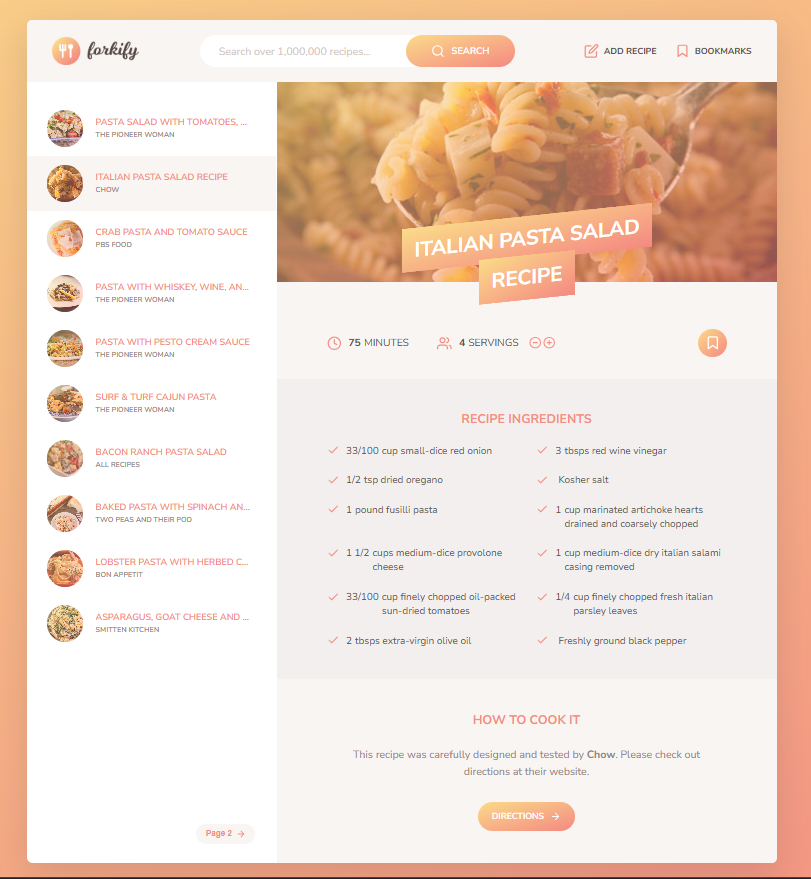
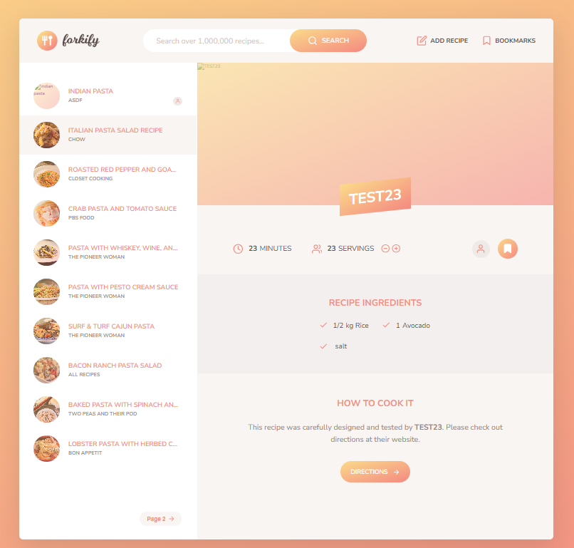
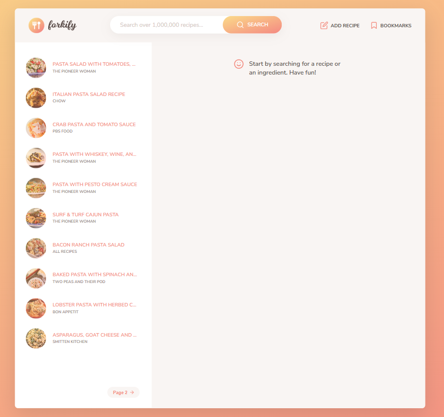

# 🍽️ Forkify

Forkify is a **modern web application** that allows users to **search for recipes**, view **detailed ingredients**, and **bookmark** their favorite recipes. It is built using **JavaScript** and integrates an API to fetch real-time recipe data.

---

## 🚀 Features

✅ Search for recipes by name or ingredient  
✅ View detailed recipe instructions and ingredient lists  
✅ Bookmark favorite recipes for easy access  
✅ Responsive and user-friendly UI

---

## 🛠️ Technologies Used

- **JavaScript (ES6+)**
- **HTML5 & CSS3**
- **Webpack & Babel**
- **Forkify API integration**

---

## 📥 Installation

Follow these steps to set up the project locally:

1️⃣ **Clone the repository**

```sh
git clone https://github.com/yourusername/forkify.git
```

2️⃣ **Navigate to the project directory**

```sh
cd forkify
```

3️⃣ **Install dependencies**

```sh
npm install
```

4️⃣ **Start the development server**

```sh
npm start
```

---

## 🎯 Usage

1️⃣ Open the application in your **browser**.  
2️⃣ Use the **search bar** to find recipes.  
3️⃣ Click on any **recipe** to view details.  
4️⃣ **Bookmark** recipes for later use.

---

## 📸 Screenshots

Here are some screenshots of the application:

### Recipe Page



### New Recipe Form


### New Recipe Page



### Bookmarks Page


### Search Page



---

## 🌐 API

This project uses the **Forkify API** to fetch recipe data. You can check the API documentation [here](https://forkify-api.herokuapp.com/).

---

## 🤝 Contributing

💡 Contributions are **welcome!** Feel free to **fork** the repository and submit **pull requests**.
